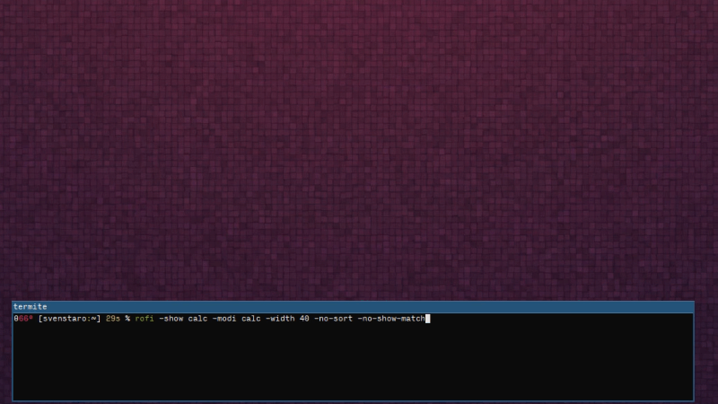

# rofi-calc

**🖩 Do live calculations in rofi!**

[](https://travis-ci.com/svenstaro/rofi-calc)
[](https://aur.archlinux.org/packages/rofi-calc/)
[](https://github.com/svenstaro/rofi-calc/blob/master/LICENSE)

A [rofi](https://github.com/DaveDavenport/rofi) plugin that uses libqalculate's `qalc` to parse natural language input and provide results.

Since this uses libqalculate's amazing `qalc` you can try natural language queries such `500 + 25%` or `5000 EUR to USD` or `150 to hex`. It can also solve linear equations on the fly. Try `60x + 30 = 50`, for instance.



Run rofi like:

    rofi -show calc -modi calc -no-show-match -no-sort

It's convenient to bind it to a key combination in i3. For instance, you could use:

    bindsym $mod+c exec --no-startup-id "rofi -show calc -modi calc -no-show-match -no-sort"

## Compilation

### Dependencies

You need a C compilation toolchain (a `cc`, `autoconf`, `pkg-config`, ...), `rofi` (version >= 1.5) as well as `libqalculate` (version > 2.0).

You will also need development headers for `rofi` and `libqalculate`. Depending on your distribution these may be included in different packages:

* Arch: included with `rofi`, `libcalculate`
* Debian, Ubuntu: `rofi-dev`, `libcalculate-dev`
* CentOS, Solus: `rofi-devel`, `libcalculate-devel`
* Others: look it up :)

Some distributions ship an [extremely outdated](https://github.com/svenstaro/rofi-calc/issues/7) version of `libqalculate` so you might have to compile your own.

### Installation

#### On Arch Linux

[rofi-calc in AUR](https://aur.archlinux.org/packages/rofi-calc/)

#### From source

**rofi-calc** uses autotools as build system. If installing from git, the following steps should install it:

```bash
$ autoreconf -i
$ mkdir build
$ cd build/
$ ../configure
$ make
$ make install
```
